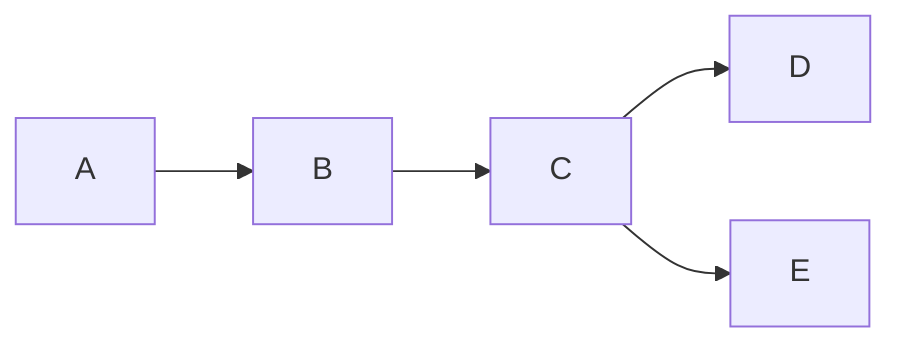
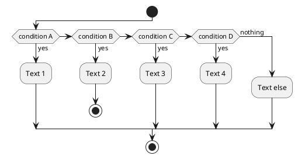

# ASCP 2019 Study Guide

Based on August 2018 content guidline and reading list

## Test to link

[Navigation](navigation.md)

Well that worked

## Mermaid incorporation test

### Flowchart




I just had to change the theme to default
Im supposed to be able to just add html and have mermaid work after the script

### Sequence Diagram

<script src="mermaid.min.js"></script>
<script>mermaid.initialize({startOnLoad:true});</script>

<div class ="mermaid">
sequenceDiagram
    Alice->>John: Hello John, how are you?
    John-->>Alice: Great!
</div>

## Flow.js incorporation test

```flow
st=>start: Start:>
e=>end:>
op1=>operation: My Operation
sub1=>subroutine: My Subroutine
cond=>condition: Yes
or No?:>
io=>inputoutput: catch something...
para=>parallel: parallel tasks

st->op1->cond
cond(yes)->io->e
cond(no)->para
para(path1, bottom)->sub1(right)->op1
para(path2, top)->op1
```

Learning that I can really only use these to see a preview and export that preview

## Plant UML incorporation test

