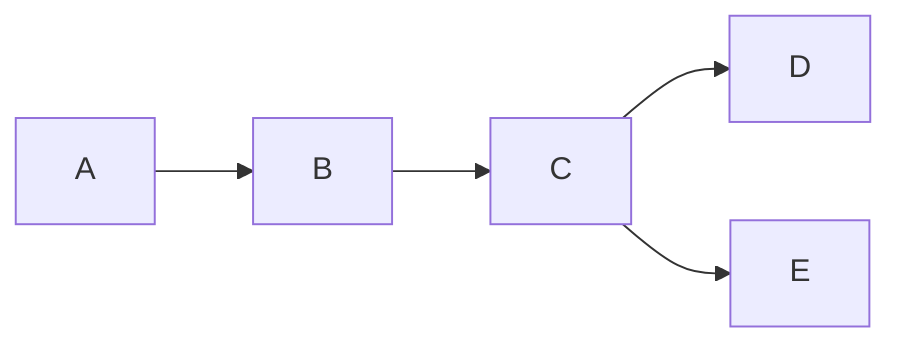
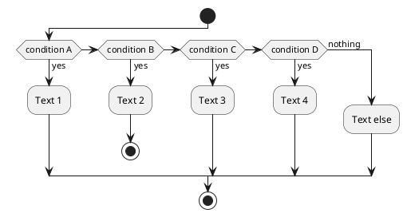

# ASCP 2019 Study Guide

Based on August 2018 content guidline and reading list

## Test to link

[Navigation](navigation.md)

Well that worked

## Mermaid incorporation test

### Flowchart

## Plant UML incorporation test

